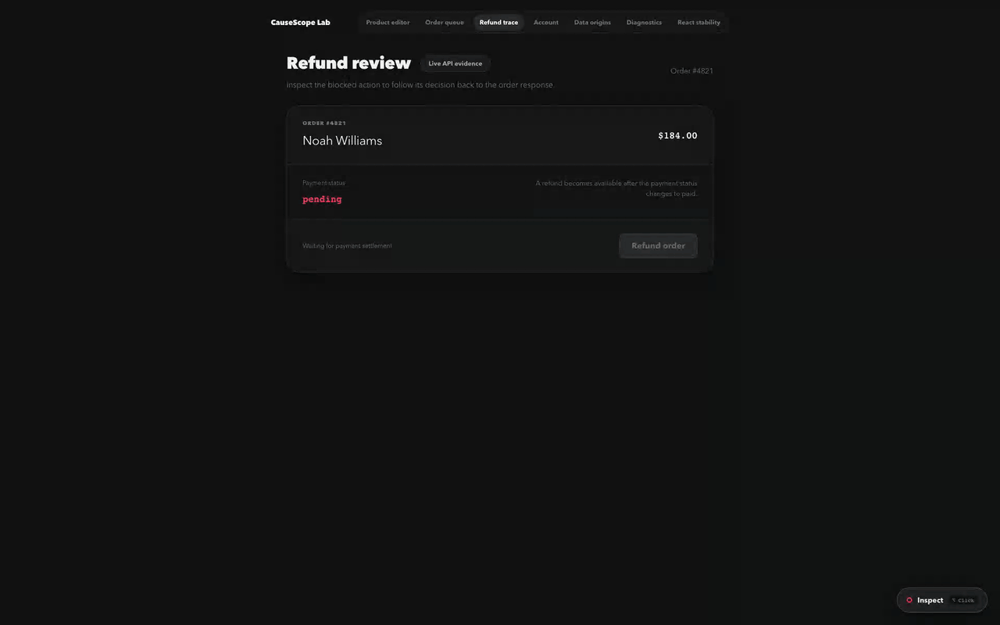

<div align="center">


# CauseScope

**点击任意界面，追踪它为何出现。**

面向 React 的本地优先证据检查器。选中一个普通页面元素，就能沿着真实证据回到精确 TSX、实时判断、状态更新、Props、Store 或网络请求。

[](https://www.npmjs.com/package/causescope)
[](https://github.com/stackloomdev/causescope/actions/workflows/ci.yml)
[](LICENSE)

[在线实验室](https://stackblitz.com/fork/github/stackloomdev/causescope/tree/main/examples/stackblitz?title=CauseScope%20Live%20Lab) · [文档](https://stackloomdev.github.io/causescope/) · [60 秒接入](https://stackloomdev.github.io/causescope/getting-started) · [路线图](ROADMAP.md) · [讨论区](https://github.com/stackloomdev/causescope/discussions) · [English](README.md)

</div>



## 找到表象背后的答案

“为什么这个按钮是 disabled？”只是一个有用场景，不是写死的产品模型。CauseScope 可以选择按钮、普通文本、输入框、列表以及其他 DOM 元素，并展示这个元素真正存在的证据：

```text
<button disabled={!canRefund}>Refund order</button>
                     │
                     ├─ canRefund → false
                     ├─ order.status === "paid" → false
                     ├─ order.status = "pending"
                     └─ GET /api/orders/4821 · 200
```

如果选中的是静态文本，或者不存在动态判断，CauseScope 就只展示精确源码与组件位置。证据缺失或存在歧义时会明确标记 unavailable，不会编造结论。

## 一分钟接入

```bash
pnpm add -D causescope@beta
```

```ts
// vite.config.ts
import react from "@vitejs/plugin-react";
import { defineConfig } from "vite";
import causeScope from "causescope/vite";

export default defineConfig({
  plugins: [react(), causeScope()],
});
```

启动 Vite 开发服务，点击右下角的 **Inspect** 并选择元素；也可以按住 <kbd>Option</kbd>/<kbd>Alt</kbd> 点击。键盘用户可将焦点移到 **Inspect**，按 <kbd>Enter</kbd>，再聚焦页面元素并按 <kbd>Enter</kbd> 或 <kbd>Space</kbd>；方向键切换面板标签，<kbd>Escape</kbd> 关闭。抽屉打开后，可直接选择页面上的另一个元素，无需再次进入检查模式。

CauseScope 只在开发模式的 `vite serve` 中运行。生产包不包含插桩、面板、编辑器接口或调试属性。

## 面板展示什么

| 视图 | 证据 |
| --- | --- |
| Why | 源码片段、表达式结果、操作数、条件树、隐藏分支、数据来源 |
| Values | 当前组件实例的 Props 与 Hook State |
| State | 初始值、最近一次真实 Setter/Reducer 更新、源码、触发事件 |
| Network | Fetch/XHR 元数据、响应大小，以及关联字段路径 |
| Timeline | DOM 事件 → Handler → State/Store 更新 → Render → 表达式变化 |

同时提供精确文件、行、列坐标，以及不绑定具体 IDE 的 **Open in editor** 操作。

## 与现有工具的分工

CauseScope 是现有开发工具的补充，而不是替代品。

| 工具类别 | 最擅长 | 证据深度 |
| --- | --- | --- |
| React DevTools | 组件树、Props、Hooks | 组件级运行时视图 |
| 性能扫描工具 | 发现高开销渲染 | 性能观测 |
| 源码定位工具 | 打开组件文件 | UI → 源码位置 |
| **CauseScope** | 解释页面为什么呈现当前值或状态 | **UI → TSX → 判断 → 更新来源** |

## 可选数据适配器

请在 React 首次渲染前安装适配器，使初始缓存和 Store 值也保留来源。

```ts
if (import.meta.env.DEV) {
  const [{ getCauseScopeRuntime }, { reactQueryAdapter }, { zustandAdapter }] = await Promise.all([
    import("causescope"),
    import("causescope/adapters/react-query"),
    import("causescope/adapters/zustand"),
  ]);

  const runtime = getCauseScopeRuntime();
  runtime.installAdapter(reactQueryAdapter({ queryClient }));
  runtime.installAdapter(zustandAdapter({ stores: { editorStore } }));
}
```

React Query 来源包含 query key、status、fetch status 和更新时间。Zustand Store 需要显式传入；CauseScope 不会扫描无关 Store。

## 兼容性

| 集成 | 支持范围 |
| --- | --- |
| React | 18、19 |
| React 渲染边界 | Portal、Suspense、Error Boundary、Vite Fast Refresh |
| Vite | 5、6、7、8 |
| React Vite 插件 | Babel（`@vitejs/plugin-react`）和 SWC（`@vitejs/plugin-react-swc`） |
| 样式方案 | CSS Modules、Tailwind CSS 4 |
| Node.js | Vite 5 可使用 18.18+；其他版本遵循所选 Vite 的 Node.js 要求 |
| TypeScript | 一等支持；应用与工具代码使用 TS/TSX，不包含 JS/JSX 源文件 |
| 包管理器 | 消费端可用任意 npm 兼容客户端；仓库自身使用 **pnpm Workspace + Turborepo** |

CI 会把打包后的 npm 产物分别安装进隔离的 Vite 5.4、6.4、7.3、8.1 消费端，并执行真实 TSX 转换。[`examples/`](examples) 还覆盖 React 18/19、Babel/SWC、多页面、多组件、多文件、Portal、Suspense、Error Boundary、Fast Refresh、React Query 与 Zustand 浏览器场景。

产物体积也有独立门禁：浏览器 runtime 图、Vite 插件、可选适配器、发布文件和 npm tarball 都受[性能预算](https://stackloomdev.github.io/causescope/performance)约束。

## 隐私与边界

CauseScope 不需要账号，没有遥测、远程服务或上传链路。Network 与 Storage 追踪只在开发环境工作，并可分别关闭。它只记录当前页面运行期间真正访问过的 Storage key，不会枚举浏览器存储。

Authorization、Cookie、API Key、Token、Password、Secret 等常见变体会在请求头、URL、对象、面板和导出结果中脱敏。默认记录上限为 10,000 个 trace 节点、200 条时间线事件、单响应 1 MB、响应总量 20 MB。

在敏感业务中使用前，请阅读[隐私与威胁模型](https://stackloomdev.github.io/causescope/privacy)。

## 开发 Monorepo

CauseScope 使用 pnpm Workspace + Turborepo。

```bash
pnpm install
pnpm check
```

完整检查包含类型检查、单元测试、全部构建、生产产物无残留与性能预算扫描、隔离 StackBlitz 构建、Vite 5–8 独立安装消费端，以及 Playwright 端到端测试。

欢迎提交 Issue 和 Pull Request。参与前请先阅读[路线图](ROADMAP.md)、[贡献指南](CONTRIBUTING.md)、[支持说明](SUPPORT.md)、[安全策略](SECURITY.md)和[行为准则](CODE_OF_CONDUCT.md)。安装问题和早期想法请先发到 [Discussions](https://github.com/stackloomdev/causescope/discussions)。

项目采用 [MIT License](LICENSE)。
