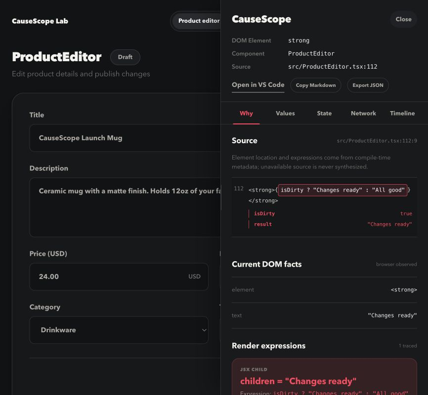

<main class="cs-landing">
  <section class="cs-hero" aria-labelledby="hero-title">
    

      
 Local-first · Development only

      <h1 id="hero-title">The evidence chain <em>behind any React UI.</em></h1>
      
Click a rendered element. CauseScope follows it back to the exact TSX, live expression, deciding branch, state transition, prop, store, or request that produced it.

      

        <a class="cs-button cs-button-primary" href="./getting-started">Install in one minute ↗</a>
        <a class="cs-button cs-button-secondary" href="https://stackblitz.com/fork/github/stackloomdev/causescope?startScript=dev%3Astackblitz">Try the live lab</a>
      

      

        React 18–19Vite 5–8No accountZero production code
      

    

    

      

        <i></i><i></i><i></i>
        <code>localhost:5173/orders</code>
        <b>INSPECTING</b>
      

      
      

      
<small>01 · SOURCE</small><strong>ProductEditor.tsx:112</strong>

      
<small>02 · STATE</small><strong>isDirty = true</strong>

    

  </section>

  <section class="cs-chain" aria-labelledby="chain-title">
    

      THE TRACE, NOT A GUESS
      <h2 id="chain-title">One click. Four layers of evidence.</h2>
      
CauseScope keeps the DOM, source, runtime values, and update history connected—so each answer shows where it came from.

    

    <ol class="cs-chain-grid">
      <li>01<b>Rendered UI</b>
Select text, buttons, inputs, lists, or any ordinary DOM element.
</li>
      <li>02<b>Exact TSX</b>
See the component, file, line, column, source snippet, and component stack.
</li>
      <li>03<b>Live decision</b>
Inspect operands, computed results, conditions, props, hooks, and stores.
</li>
      <li>04<b>Update trail</b>
Follow setter calls, events, network requests, and storage changes over time.
</li>
    </ol>
  </section>

  <section class="cs-case" aria-labelledby="case-title">
    

      A REAL DEBUGGING QUESTION
      <h2 id="case-title">“Why can’t this order be refunded?”</h2>
      
The disabled button is only the symptom. The useful answer is the branch and the live value behind it.

      
Refund order<small>disabled</small>

    

    

      
ELEMENT<code>&lt;button disabled={!canRefund}&gt;</code>

      
DECISION<code>canRefund → false</code>

      
OPERAND<code>order.status === "paid" → false</code>

      
STATE<code>order.status = "pending"</code>

      
ORIGIN<code>GET /api/orders/4821 · 200</code>

      
5 linked observations<b>Local browser memory only</b>

    

  </section>

  <section class="cs-principles" aria-labelledby="principles-title">
    

      BUILT FOR THE INNER LOOP
      <h2 id="principles-title">Evidence-rich without becoming infrastructure.</h2>
    

    

      <article>LOCAL<h3>Your app stays on your machine.</h3>
No account, cloud service, API key, telemetry, or upload path. Export redaction is applied again before data leaves the panel.
</article>
      <article>PRECISE<h3>Coordinates you can act on.</h3>
Jump from a normal page element to its exact TSX location, then switch directly to another element without restarting inspection.
</article>
      <article>ABSENT<h3>Nothing ships to production.</h3>
The plugin runs only in Vite’s development server. Production builds contain no overlay, endpoint, instrumentation, or debug attributes.
</article>
    

  </section>

  <section class="cs-compare" aria-labelledby="compare-title">
    

      A DIFFERENT LAYER
      <h2 id="compare-title">Use the right instrument for the question.</h2>
      
CauseScope complements the tools already in a React developer’s browser.

    

    

      <table>
        <thead><tr><th>Tool category</th><th>Best at</th><th>Evidence chain</th></tr></thead>
        <tbody>
          <tr><td>React DevTools</td><td>Component tree, props, and hooks</td><td>Component-level runtime view</td></tr>
          <tr><td>Performance scanners</td><td>Finding expensive renders</td><td>Performance observations</td></tr>
          <tr><td>Source locators</td><td>Opening a component file</td><td>UI → source location</td></tr>
          <tr class="cs-table-featured"><td>CauseScope</td><td>Explaining why rendered UI has its current value or state</td><td>UI → TSX → decision → update origin</td></tr>
        </tbody>
      </table>
    

  </section>

  <section class="cs-install" aria-labelledby="install-title">
    

      TWO LINES TO START
      <h2 id="install-title">Add evidence to your next debugging session.</h2>
      
CauseScope supports React 18–19 and Vite 5–8. This repository is a pnpm Workspace + Turborepo monorepo; consumers can use any npm-compatible package manager.

      

        <a class="cs-button cs-button-primary" href="./getting-started">Read the guide ↗</a>
        <a class="cs-button cs-button-secondary" href="https://github.com/stackloomdev/causescope">View the source</a>
      

    

    

      
<b>terminal</b>vite.config.ts

      <pre><code>$ pnpm add -D causescope@beta  import causeScope from "causescope/vite";  export default defineConfig({
  plugins: [react(), causeScope()],
});</code></pre>
    

  </section>
</main>
